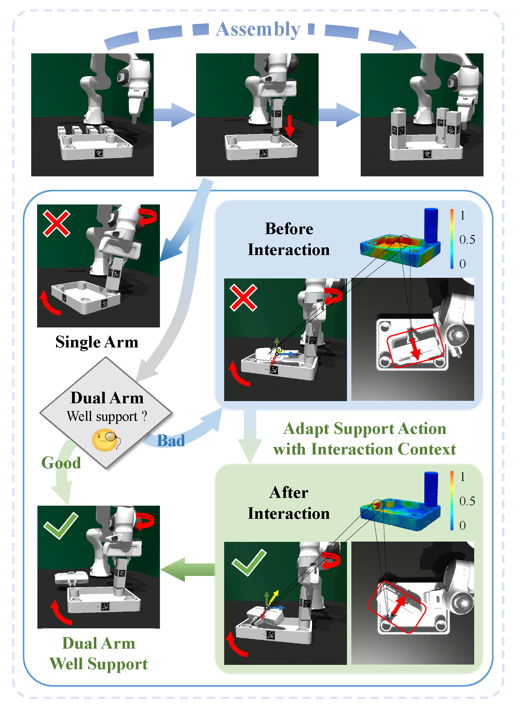
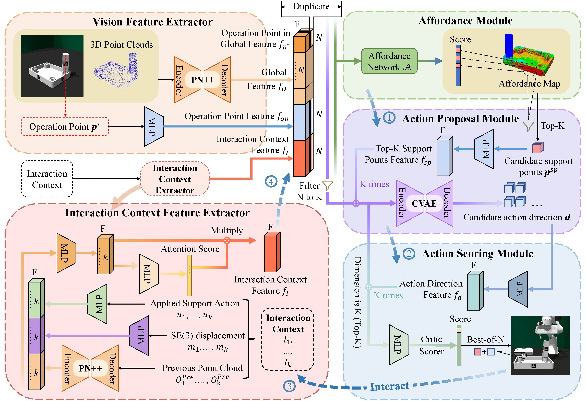
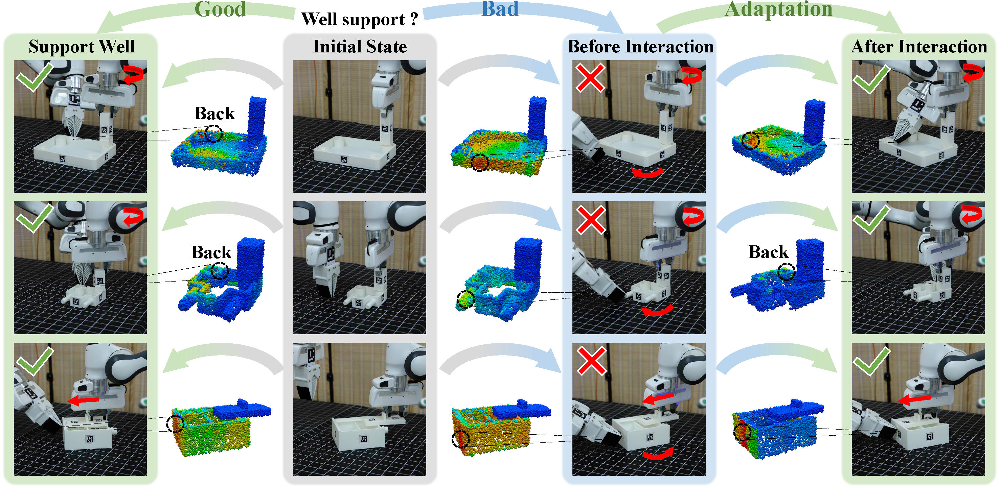

<h2 align="center">

  <b><tt>A3D</tt>: <br>

  Adaptive Affordance Assembly with <br>

  Dual-Arm Manipulation</b>

</h2>

<div align="center" margin-bottom="6em">

<b>AAAI 2026 Oral</b>

</div>

<br>

<div align="center">
    <a href="" target="_blank">
    </a>
    <a href="https://skywalker-yqz.github.io/A3D/" target="_blank">
    </a>
</div>

<br>

<p align="center">
  
</p>

**A3D** proposes a novel adaptive affordance learning framework for dual-arm manipulation in assembly tasks. The key insight is that effective support actions in dual-arm assembly require adaptation based on interaction context. Our framework includes three major components:

- **Adaptive Affordance with Interaction Context**: We introduce <u>Interaction Context</u> to capture the dynamic relationship between assembly parts during manipulation. The affordance map adapts based on previous interactions, enabling the support arm to provide well-coordinated assistance.

- **Dual-Arm Coordination Framework**: Our method addresses the challenge of <u>Dual-Arm Coordination</u> in assembly tasks where a single arm cannot complete the task. The support arm learns to adapt its position and orientation based on the operating arm's actions and object states.

- **Generalizable Policy**: With the interaction-aware affordance representation, we introduce a policy architecture combining <u>Affordance Module</u>, <u>Action Proposal Module</u>, and <u>Action Scoring Module</u> to achieve cross-category generalization in assembly tasks.


## 📢 MileStone

- [x] *(Coming Soon)* A3D **Simulation Environment** Release !

- [x] *(Coming Soon)* A3D **Data Collection Pipeline** Release !

- [x] *(Coming Soon)* A3D **Policy Training Code** Release !

- [ ] *(Coming Soon)* A3D **Dataset** Release !

- [ ] *(Coming Soon)* A3D **Real-World Deployment** Release !

## 📖 Usage

**1. Setup Conda Environment**

```bash
conda create -n a3d python=3.8
conda activate a3d
conda install pytorch==2.4.1 torchvision==0.19.1 torchaudio==2.4.1 pytorch-cuda=11.8 -c pytorch -c nvidia
```

**2. Install IsaacGym**

The A3D's simulation environment is built as a modified version of [Furniture-Bench](https://github.com/clvrai/furniture-bench). All required modifications to Furniture-Bench are already included in this repository. Therefore, there is no need to install Furniture-Bench separately.

First, visit the official [Isaac Gym](https://developer.nvidia.com/isaac-gym) website and download the `Isaac Gym – Ubuntu Linux 18.04 / 20.04 Preview 4 release`. Then, extract the downloaded .zip file to your preferred directory.

```bash
cd <path/to/isaacgym>
pip install -e python
```

**3. Additional Environment Dependencies for Project**

```bash
pip install -r requirements.txt
```

>[!NOTE]
>
>If you encounter error in `gym 0.21.0` setup, please try the following command:
>```bash
> pip install setuptools==65.5.0 pip==21  
> pip install wheel==0.38.0
> pip install gym==0.21.0
>```

>[!NOTE]
>
>When running a furniture asset for the first time, the system may take several minutes to convert the corresponding 3D mesh into a Signed Distance Function (SDF). The generated SDF is cached under ~/.isaacgym for subsequent runs.

## 🏕️ Simulation Environment


We introduce multiple assembly manipulation tasks across different categories, encompassing:

- **Multi-Part Assembly Tasks**: ```Screw Table Legs``` (desk, desk_1, desk_2, desk_3, desk_r, desk_1_r, desk_2_r, desk_3_r), ```Push Drawers``` (drawer_top, drawer_top_1, drawer_top_2, drawer_bottom, drawer_bottom_1, drawer_bottom_2). These tasks require dual-arm coordination where one arm operates while the other provides support.

- **Single-Part Manipulation Tasks**: ```Pick Up``` (cask, bucket, drawer_c). These tasks focus on grasping and lifting objects with appropriate support strategies.

The key variables include **object position**, **orientation**, **shape**, and **interaction context** during manipulation.

## ⚒️ Data Collection

We provide two scripts for collecting training data:

- **collect_data.py**: Used to collect training data for tasks that involve **at least two parts**.
- **collect_data_one_part.py**: Used to collect training data for tasks that involve **only one part**.

```bash
# For multi-part assembly tasks
python workspace/collect_data.py --task <task_name>

# For single-part manipulation tasks
python workspace/collect_data_one_part.py --task <task_name>
```

If you want to adjust the number of interaction steps during data collection, modify the parameter in `env.set_check_t(1)`, which controls the maximum number of allowed interactions during data collection.

The file structure after data collection:

```
data/
├── desk_1/                    # task name
│   ├── failed/                # data of finally failed attempts
│   │   ├── data_0.pt
│   │   ├── data_1.pt
│   │   └── ...
│   └── finished/              # data of finally successful attempts
│       ├── data_0.pt
│       ├── data_1.pt
│       └── ...
├── desk_2/
│   └── ...
└── ...
```

## 🚀 Policy Architecture



Our policy **A3D** consists of three main modules:

- **Affordance Module**: Generates affordance maps that indicate optimal support positions. The affordance network learns to predict support point scores based on 3D point cloud observations and interaction context.

- **Action Proposal Module (Actor)**: Proposes candidate support actions including position and direction. Uses a CVAE-based architecture to generate diverse action candidates.

- **Action Scoring Module (Critic)**: Evaluates and ranks the proposed actions using a Best-of-N selection strategy. Learns to predict action success probability based on the current state and proposed actions.

### Training

All collected data should be merged into a single directory for training the **Critic module** and the **Affordance module**. A separate directory containing only successful samples should be prepared for training the **Actor module**.

**1. Train Critic Module**

```bash
python workspace/train/train_critic_ada.py --data_dir data/ --save_dir log/ --task desk --train_num 10000 --val_num 2000 --use_normals

# usage template: 
# python workspace/train/train_critic_ada.py --data_dir <path/to/data> --save_dir <path/to/save> --task <task_name> --train_num <num_uses_for_train> --val_num <num_uses_for_val> --use_normals

# File will find data in path <data_dir/task>
# Detailed parameters information can be found in the 'train_critic_ada.py' file
```

**2. Train Actor Module**

```bash
python workspace/train/train_actor_ada.py --data_dir data_s/ --save_dir log/ --task desk --train_num 5000 --val_num 2000 --use_normals

# usage template: 
# python workspace/train/train_actor_ada.py --data_dir <path/to/data> --save_dir <path/to/save> --task <task_name> --train_num <num_uses_for_train> --val_num <num_uses_for_val> --use_normals

# File will find data in path <data_dir/task>
# We only train actor using successful samples
# Detailed parameters information can be found in the 'train_actor_ada.py' file
```

**3. Train Affordance Module**

```bash
python workspace/train/train_aff_ada.py --data_dir data/ --save_dir log/ --task desk --actor log/desk/actor/ckpts/100-network.pth --critic log/desk/critic/ckpts/100-network.pth --train_num 10000 --val_num 2000 --use_normals

# usage template: 
# python workspace/train/train_aff_ada.py --data_dir <path/to/data> --save_dir <path/to/save> --task <task_name> --actor <path/to/actor_ckpt> --critic <path/to/critic_ckpt> --train_num <num_uses_for_train> --val_num <num_uses_for_val> --use_normals

# File will find data in path <data_dir/task>
# Detailed parameters information can be found in the 'train_aff_ada.py' file
```

## 🎯 Policy Validation

We provide validation files `model_test_ada.py` and `model_test_one_part_ada.py` for testing trained policies.

```bash
# For multi-part assembly tasks
python workspace/model_test_ada.py --task desk --aff <aff_ckpt> --actor <actor_ckpt> --critic <critic_ckpt>

# For single-part manipulation tasks
python workspace/model_test_one_part_ada.py --task cask --aff <aff_ckpt> --actor <actor_ckpt> --critic <critic_ckpt>

# usage template:
# python workspace/model_test_ada.py --task <task_name> --aff <aff_ckpt> --actor <actor_ckpt> --critic <critic_ckpt>
```

## 🌍 Real-World Experiments



Our method demonstrates strong generalization capability in real-world dual-arm manipulation scenarios. The adaptive affordance learning enables the robot to adjust its support strategy based on interaction feedback, achieving robust performance across different object categories and configurations.

## 🙏 Acknowledgements

We sincerely thank the authors of the following open-source projects, which were instrumental in our work:
- [Furniture-Bench](https://github.com/clvrai/furniture-bench)

## 📑 Citation

If you find this repository useful in your research, please consider starring ⭐ this repo and citing 📑 our paper:

```bibtex
@inproceedings{a3d2026,
    title={A3D: Adaptive Affordance Assembly with Dual-Arm Manipulation},
    author={Liang, Jiaqi and Chen, Yue and Yu, Qize and Shen, Yan and Zhang, Haipeng and Dong, Hao and Wu, Ruihai},
    booktitle={Proceedings of the AAAI Conference on Artificial Intelligence},
    year={2026}
}
```
