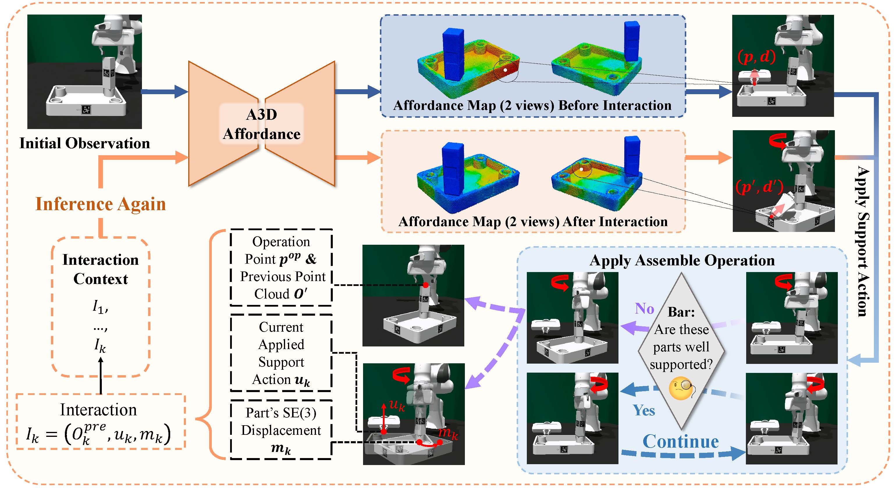

<h2 align="center">
  <b><tt>A3D</tt>:Adaptive Affordance Assembly with Dual-Arm Manipulation</b>
</h2>

<div align="center" margin-bottom="6em">
<b>AAAI 2026 Oral</b>
</div>

<br>

<!-- <div align="center">
    <a href="" target="_blank">
    </a>
    <a href="" target="_blank">
    </a>
    <a href="" target="_blank">
    </a>
    <a href="" target="_blank">
    </a>
</div> -->

<br>




## 📖 Usage
The A3D's simulation environment is built as a modified version of [Furniture-Bench](https://github.com/clvrai/furniture-bench).
All required modifications to Furniture-Bench are already included in this repository.
Therefore, there is no need to install Furniture-Bench separately.

**1. Setup conda environment**
```bash
conda create -n a3d python=3.8
conda activate a3d
conda install pytorch==2.4.1 torchvision==0.19.1 torchaudio==2.4.1 pytorch-cuda=11.8 -c pytorch -c nvidia
```

**2. Install IsaacGym**

First, visit the official [Isaac Gym](https://developer.nvidia.com/isaac-gym) website and download the `Isaac Gym – Ubuntu Linux 18.04 / 20.04 Preview 4 release`.
Then, extract the downloaded .zip file to your preferred directory.

```bash
cd <path/to/isaacgym>
pip install -e python
```


**3. Additional Environment Dependencies for Project**

```bash
isaac -m pip install -r requirements.txt
```


## Data Collection

We provide two scripts, `collect_data.py` and `collect_data_one_part.py`, for collecting training data.

- **collect_data.py** is used to collect training data for tasks that involve **at least two parts**. The supported multi-part tasks include, for example, screwing table legs (`desk`, `desk_1`, `desk_2`, `desk_3`, `desk_r`, `desk_1_r`, `desk_2_r`, `desk_3_r`) and pushing drawers (`drawer_top`, `drawer_top_1`, `drawer_top_2`, `drawer_bottom`, `drawer_bottom_1`, `drawer_bottom_2`).
- **collect_data_one_part.py** is used to collect training data for tasks that involve **only one part**. The supported tasks include picking up (`cask`, `bucket`, `drawer_c`)

```bash
python workspace/collect_data.py --task <task name>
```
or

```bash
python workspace/collect_data_one_part.py --task <task name>
```

If you want to adjust the number of interaction steps during data collection, modify the parameter in `env.set_check_t(1)`, which controls the maximum number of allowed interactions during data collection. 

## Training

### **Data preparation**
After data collection, you will obtain the dataset for each task.
The file structure is organized as follows:

```
├── data/  
    ├──desk_1/              # task
        ├──failed           # data of finally failed
            ├──data_0.pt
            ├──data_1.pt
            ......
        ├──finished         # data of finally finished
            ├──data_0.pt
            ├──data_1.pt
            ......
    ......
    ├──desk_2/
```

All collected data should be merged into a single directory for training the **Critic module** and the **Affordance module**.

In addition, a separate directory containing only successful samples should be prepared for training the **Actor module**.


### **Training**
1. Train Critic Module

    First, you need to train the Critic module.

    ```bash
    python workspace/train/train_critic_ada.py
    # usage template: 
    ### python workspace/train/train_critic_ada.py --data_dir <path/to/data> --save_dir <path/to/save> --task <task_name> --train_num <num_uses_for_train> --val_num <num_uses_for_val> --use_normals

    python workspace/train/train_critic_ada.py --data_dir data/ --save_dir log/ --task desk --train_num 10000 --val_num 2000 --use_normals

    # File will find data in path <data_dir/task>

    # Detailed parameters information can be found in the 'train_critic_ada.py' file
    ```

2. Train Actor Module

    ```bash
    python workspace/train/train_actor_ada.py
    # usage template: 
    ### python workspace/train/train_actor_ada.py --data_dir <path/to/data> --save_dir <path/to/save> --task <task_name> --train_num <num_uses_for_train> --val_num <num_uses_for_val> --use_normals

    python workspace/train/train_actor_ada.py --data_dir data_s/ --save_dir log/ --task desk --train_num 5000 --val_num 2000 --use_normals

    # File will find data in path <data_dir/task>
    # We only train actor use successful samples

    # Detailed parameters information can be found in the 'train_actor_ada.py' file
    ```

3. Train Affordance Module

    ```bash
    python workspace/train/train_aff_ada.py
    # usage template: 
    ### python workspace/train/train_aff_ada.py --data_dir <path/to/data> --save_dir <path/to/save> --task <task_name> --actor <path/to/actor_ckpt> --critic <<path/to/critic_ckpt> --train_num <num_uses_for_train> --val_num <num_uses_for_val> --use_normals

    python workspace/train/train_aff_ada.py --data_dir data/ --save_dir log/ --task desk --actor log/desk/actor/ckpts/100-network.pth --critic log/desk/critic/ckpts/100-network.pth --train_num 10000 --val_num 2000 --use_normals

    # File will find data in path <data_dir/task>

    # Detailed parameters information can be found in the 'train_aff_ada.py' file
    ```


## Validation

We provide Validation file `model_test_ada.py` and `model_test_one_part_ada.py`,

```bash
# usage template:
# python workspace/model_test_ada.py --task <task_name> --aff <aff_ckpt> --actor <actor_ckpt> --critic <critic_ckpt>
python workspace/model_test_ada.py --task desk --aff <aff_ckpt> --actor <actor_ckpt> --critic <critic_ckpt>

```

## Acknowledgements

We sincerely thank the authors of the following open-source projects, which were instrumental in our work:
- [Furniture-Bench](https://github.com/clvrai/furniture-bench)


<!-- ## Citation
If you find this repository useful in your research, please consider staring 🌟 this repo and citing 📑 our paper:

```
``` -->